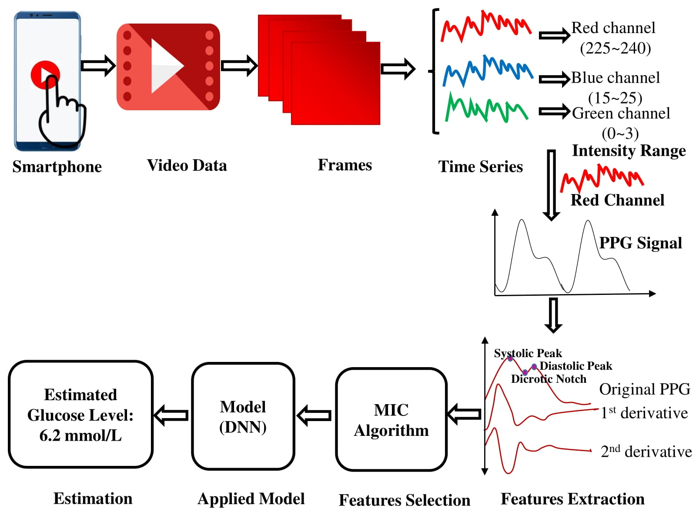
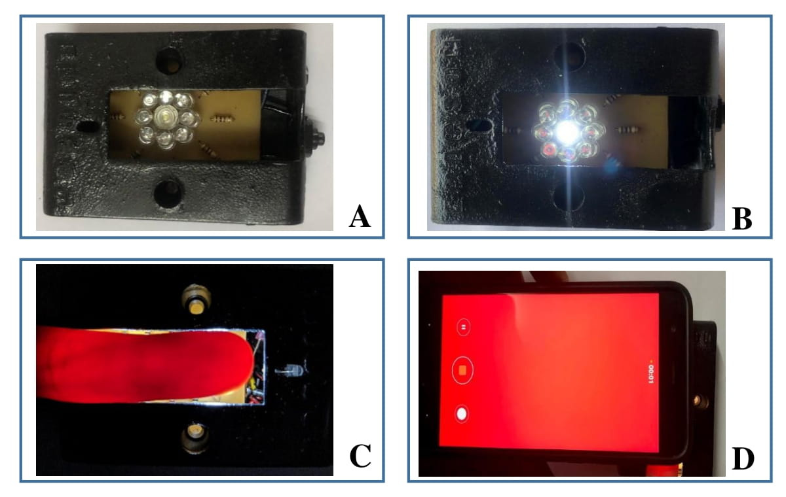

# DNN Based Blood Glucose Level Estimation Using PPG Characteristic Features of Smartphone Videos
## Abstract
<div align="justify">
Diabetes is a perpetual metabolic issue that can prompt severe complications. Blood glucose level (BGL) is usually monitored by collecting a blood sample and assessing the results. This type of measurement is extremely unpleasant and inconvenient for the patient, who must undergo it frequently. This paper proposes a novel real-time, non-invasive technique for estimating BGL with smartphone photoplethysmogram (PPG) signal extracted from fingertip video and deep neural networks (DNN). Fingertip videos are collected from 93 subjects using a smartphone camera and a lighting source, and subsequently the frames are converted into PPG signal. The PPG signals have been preprocessed with Butterworth bandpass filter to eliminate high frequency noise, and motion artifact. Therefore, there are 34 features that are derived from the PPG signal and its derivatives and Fourier transformed form. In addition, age and gender are also included as features due to their considerable influence on glucose. Maximal information coefficient (MIC) feature selection technique has been applied for selecting the best feature set for obtaining good accuracy. Finally, the DNN model has been established to determine BGL non-invasively. DNN model along with the MIC feature selection technique outperformed in estimating BGL with the coefficient of determination ( R^2) of 0.96, implying a good relationship between glucose level and selected features. The results of the experiments suggest that the proposed method can be used clinically to determine BGL without drawing blood.
</div>


<div align="center">
    
    <p><em>Figure 1: The overall system architecture for non-invasive BGL measurement.</em></p>
</div>

## Data Collection Device

<div align="center">
    
    <p><em>Figure 2: Hardware used to capture fingertip videos: A) A NIR LED device/data collection kit in turned off, B) A NIR LED device in turned on for data collection, C) Index finger on the device while NIR LED device is on, D) Nexus 6p smartphone is used to record video while LEDs illuminate the finger.</em></p>
</div>

### Dataset requirements

create a dataset as follows:
 
```
dataset_folder
    |-raw_videos
        |-1.mp4
        |-2.mp4
        |-3.mp4
        |-...........
        |-...........

    |-data.csv

```

```
* data.csv colums:

    * SL              : Serial No.
    * Patient's ID    : ID of Subjects (like, 0001, 0901, ...)
    * Name            : Name of subjects (xyz, abcd, ...)
    * Age             : Age of subjects (12,69, ...)
    * Sex(M/F)        : Male or Female (M/F)
    * File_ext(*.mp4) : video file extension (.mp4)
    * Gl (mmol/L)     : Glucose concentration
```

### Execution
- ```conda activate my_env```
- ```cd scripts```
- run: ```./server.sh```

### Refereneces:

**Cite:** Please cite the following papers. If you find this code useful in your research, please consider citing.
```
@inproceedings{raju2022dnn,
  title={DNN Based Blood Glucose Level Estimation Using PPG Characteristic Features of Smartphone Videos},
  author={Raju, SM Taslim Uddin and Hashem, MMA},
  booktitle={2022 25th International Conference on Computer and Information Technology (ICCIT)},
  pages={13--18},
  year={2022},
  organization={IEEE}
}
```
